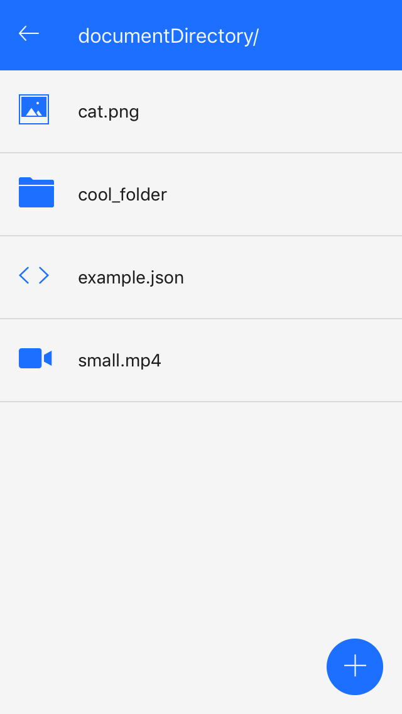
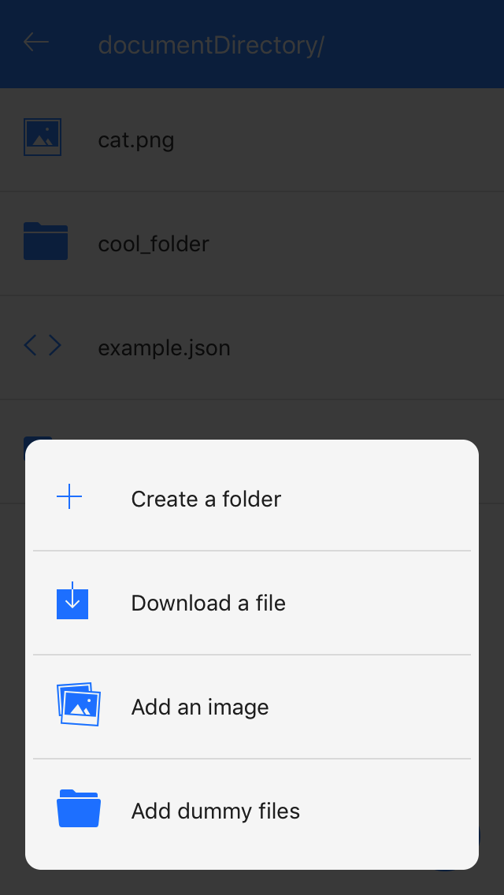

# expo-file-system-view
View & debug your expo app file system.

Hate managing file system code? Annoyed of tediously checking if files get saved correctly or exist? Now you can easily view and debug your apps file system in an easy to understand interface. Using it is easy, just drop the component on any screen in your app and make sure your file system code is doing what you want.

Check out the [demo](https://expo.io/@samee/expo-file-system-view) to play around with it.

>Note: Due to a bug in Expo.FileSystem read permissions for root directories on Android, this component currently only works on iOS. You can track the issue [here](https://github.com/expo/expo/issues/776) 

## Install
`npm install --save expo-file-system-view` or `yarn add expo-file-system-view`

 

## Usage
Drop it anywhere in your own app:
```javascript
import React from 'react'
import { View } from 'react-native'
import FileSystemView from 'expo-file-system-view'

export default class App extends React.Component {
  render () {
    return (
      <View>
        <FileSystemView />
      </View>
    )
  }
}
```
